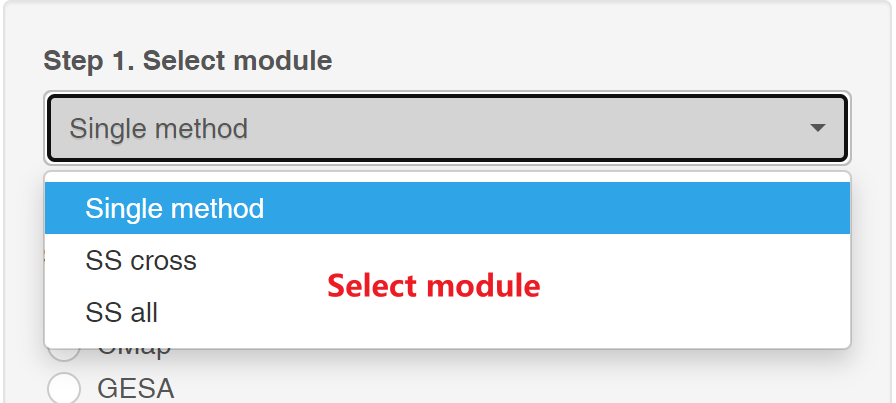

### Welcome to Application module! 
#### For demo result, please go to job center page.  
In this module, you can apply signature search (SS) methods to query drugs based on the signature input.  
Here we provide three ways to find promising drugs:  

  

As shown in the picture:
1. **Single method** : Query drugs by one of signature search methods, as the **traditional way**. Typically, **abs(logFC) > ±1** is used for filter differential expression genes.  
2. **SS cross** : Query drugs by **two signatures**, and rank them by overall scores. SS_cross aims to found poly-pharmacological drugs.
3. **SS all** : Query drugs in multiple SS methods and rank them with same direction (up or down) by robust rank aggregation (RRA), SS_all take all SS into account and found the **greatest common drugs**.  
**Different way requires different steps:**  

For **Single method**, we need four steps:  
① Select a desired signature search method,  
② Select one drug profiles,  
③ Upload your **signature file (Header with Gene and log2FC)**, and  
④ Set how many top genes (up and down) used, it may be hinted from the benchmark module or robustness module.  

For **SS cross**, steps ③ is different:  
two signatures files and their names are required, name of the first signature represents X axis and the second Y axis in result figure.

For **SS all**, steps ① is different:    
we can select some methods and direction to rank the drugs, generally, if we upload a disease signature, chose **down** , else, chose  **up**   

Finally, click the Run button and you will get a **jobid** in job center for result inquiry later.

For more information, please vist **Info-Help** page.
