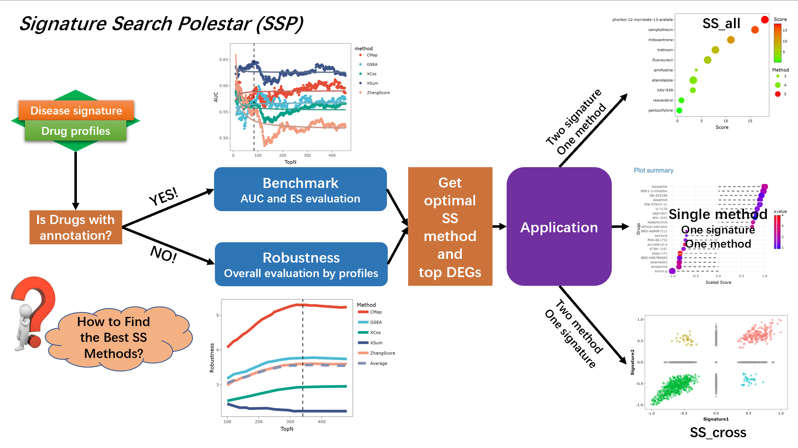

### Why we built SSP?
The growing interest in human genes and accessibility of high-throughput technologies directly lead to exponential increase data size in pharmacotranscriptomic profiles.  
Profile-based method has been widely used for screening drugs and identifying molecular actions of drugs, which could remarkably enhance novel drug-disease pair discovery without relying on drug- or disease-specific prior knowledge.  
This analysis method was named **Signature Search (SS)**.  
Meanwhile, various SS methods were proposed, but how to find the optimal method and top **differentially expressed genes (DEGs)** for certain data is still challenging.  
How to find the optimal methods and parameters for different signature input and drug profiles is still challenging.  
**Signature Search Polestar (SSP)** is a webserver integrating the largest uniform drug profiles in L1000 with five state-of-the-art (XSum, CMap, GESA, ZhangScore, XCos) and provide three modules to facilitate drug repurposing:  
1.	Benchmark: Two indices (AUC and Enrichment Score) based on drugs annotations are employed to evaluate the performance of SS methods at different top DEGs. The results indicate the best evaluation method and the top DEGs for input disease signature.  
2.	Robustness: A robust index based on drug profiles itself is developed to evaluate the overall performance of SS methods at different top DEGs. This module is applicable when meets insufficient drug annotations.  
3.	Application: Three tools (single method, SS_all, and SS_cross) enable user to utilize optimal SS methods with disease signatures. The results present scores of promising drug repurposing for disease signature.  

Additionally, SSP webserver is deployed at a high performance servers for better user experience and we opensource all codes at [Gitee](https://gitee.com/auptz/benchmark-ss) or mirror [Github](https://gitee.com/auptz/benchmark-ss). Everyone could directly use or DIY own SSP webserver by interest.

