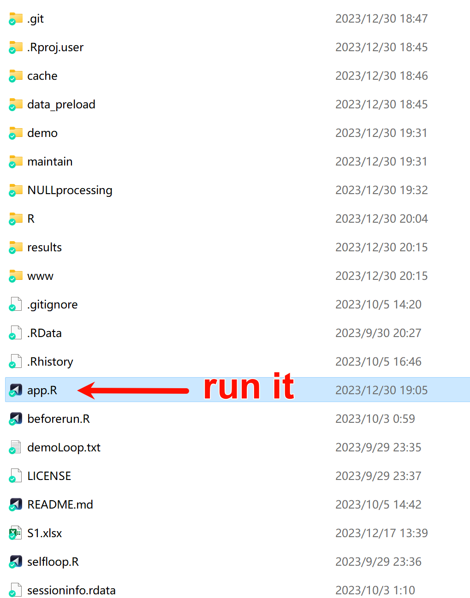

### How to deployed SSP in my own computer or server?  
Yes you can, SSP is a open-source website and you can download [A full installation of SSP](https://figshare.com/articles/software/SSP_source_codes_and_essential_data/26524741) **(~4G)**.  
We encourage users to deployed the website on their own.  

