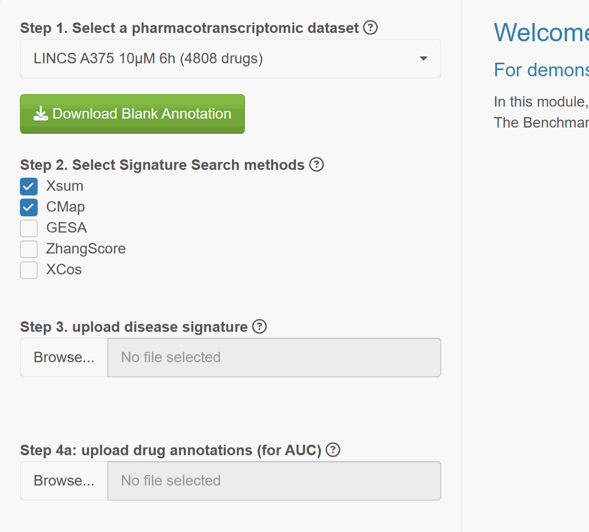
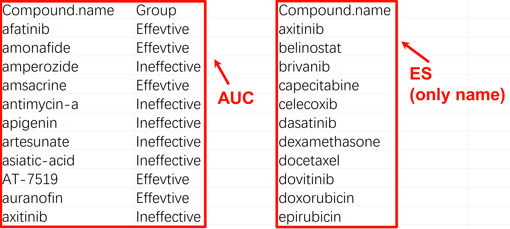
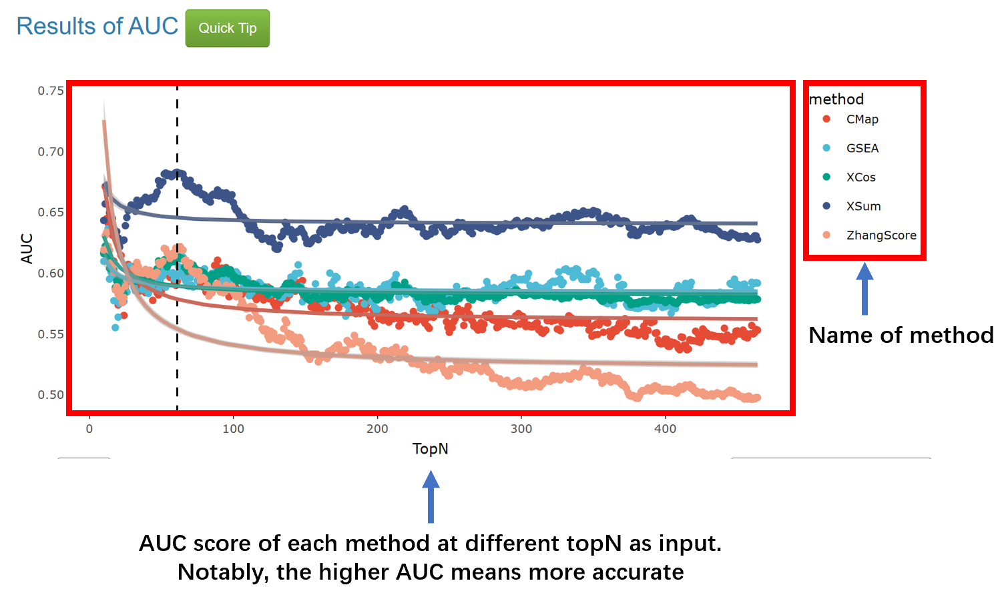
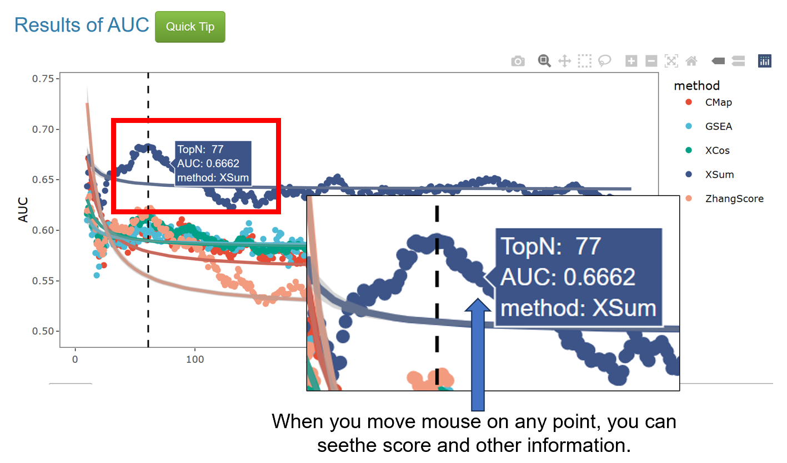
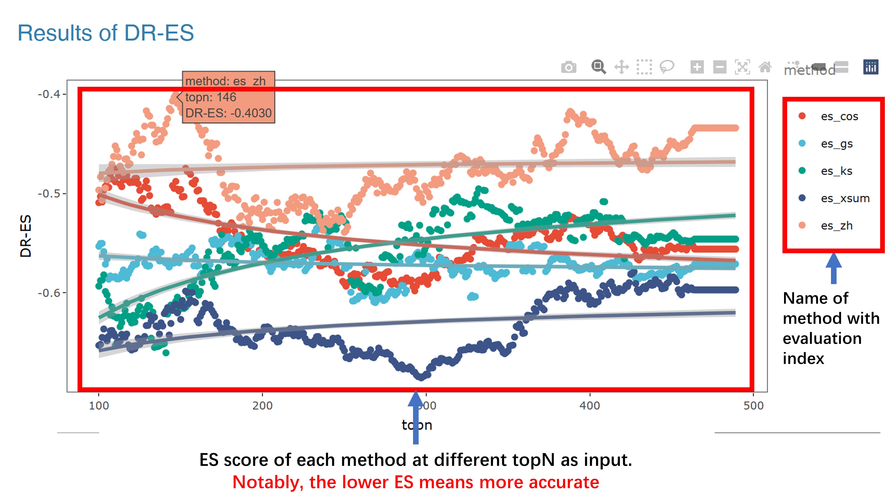

### How to use Benchmark and interpret the results?  
The **Benchmark** module aims to evaluate the performance of Signature Search (SS) methods through pharmacotranscriptomic dataset and annotations. The results could tell us which method and topN (the number of gene used for SS) are the best。  
It is very easy to use Benchmark as it only requires **at most 3 files**, a Disease Signature (necessary), and Drug Annotations for **AUC** or **ES** (at least one of them). SSP supports file input in both **CSV** and **TXT** formats.  
The demo files are provided on the **step**, you can click the question label **(?)** to show tips and download demo files.   

A Disease Signature is a two-column table starts with **Gene** and **log2FC**, although there is no requirement of p-value or adjust p-value, **we highly recommend user provides a significant signature, a gene list with p-value < 0.05**.  
Drug annotations are labels indicating whether the drug is positive and/or negative in your selected drug profile set. You can download a drug list without drug annotation by click the **Download Blank Annotation**.
For AUC, you need label drugs with whether **Positive** and **Negative** (**case sensitive**).  
For ES, you just need provide the name of **Positive** drugs without labels.  
Notably, you are not required to provide all drug annotations, but more annotations lead to more accurate results.  

Do not forget to remove unlabeled drugs! The detailed procedure is provided in the **Benchmark** page.  
The mean time of Benchmark is 15~30 mins, which is determined by the volume of pharmacotranscriptomic dataset.

Well, it is very easy to understand the results in Benchmark.  
**For the Benchmark module, here are two types of results:**  
If you upload a file for the AUC method, then you will get a result like this:  

If you upload a file for the ES method, then you will get a result like this:  

**So, it is very easy to find the best topN and method based on the signature and drug profiles.**

Notably, when ES and AUC are combined, users have to determine the best topN and method based on performance.

The best topN are required to be used in the **Application** module.

