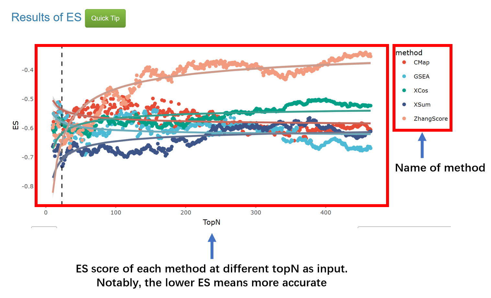

### How to use Benchmark and interpret the results? 
Considering the significant attrition rates, considerable expenses, and sluggish progress in new drug discovery and development, the idea of repurposing 'old' drugs to treat a variety of diseases is progressively gaining appeal. 
An effective method that has been validated involves annotating drugs with known diseases, thereby discovering that similar drugs may potentially have superior therapeutic effects. Currently, there are numerous methods for drug repurposing, one of which is based on pharmacotranscriptomic datasets. This method involves drug screening through disease signatures obtained from sequencing cell lines or patient tissue samples, a process we refer to as Signature Search (SS).  
The **Benchmark** module aims to evaluate the performance of Signature Search (SS) methods through pharmacotranscriptomic datasets and drug annotations. The results could tell us which method and topN (the number of gene used for SS) are the best.   
The workflow can be described as following: First, user select a pharmacotranscriptomic datasets, a *m x n* metrics which m represent drug and n represents the gene expression. Then, download a blank annotation file with drug name and fill them manually. The principle of annotation is related to the disease you are studying. For example, if you are researching liver cancer, you need to collect data on whether a drug is effective against liver cancer. These annotation can be obtained from clinical trials or cell experiments (IC50 < 10 μM). Next, upload a disease signature and annotation file(s). Finally, click the **RUN** button to get the result.  
Hence, it is very easy to use Benchmark as it only requires **at most 3 files**, a Disease Signature (necessary), and Drug Annotations for **AUC** or **ES** (at least one of them, ). SSP supports file input in both **CSV** and **TXT** formats.  
The demo files are provided on the **step**, you can click the question label **(?)** to show tips and download demo files.   

A Disease Signature is a two-column table starts with **Gene** and **log2FC**, although there is no requirement of p-value or adjust p-value, **we highly recommend user provides a significant signature, a gene list with p-value < 0.05**.  
Drug annotations are labels indicating whether the drug is positive and/or negative in your selected drug profile set. You can download a drug list without drug annotation by click the **Download Blank Annotation**.
For AUC, you need label drugs with whether **Positive** and **Negative** (**case sensitive**).  
For ES, you just need provide the name of **Positive** drugs without labels.  
Notably, you are not required to provide all drug annotations, but more annotations lead to more accurate results.  

Do not forget to remove unlabeled drugs! The detailed procedure is provided in the **Benchmark** page.  
The mean time of Benchmark is 15~30 mins, which is determined by the volume of pharmacotranscriptomic dataset.

Well, it is very easy to understand the results in Benchmark.  
**For the Benchmark module, here are two types of results:**  
If you upload a file for the AUC method, then you will get a result like this:  

If you upload a file for the ES method, then you will get a result like this:  

**So, it is very easy to find the best topN and method based on the signature and drug profiles.**

Notably, when ES and AUC are combined, users have to determine the best topN and method based on performance.

The best topN are required to be used in the **Application** module.

