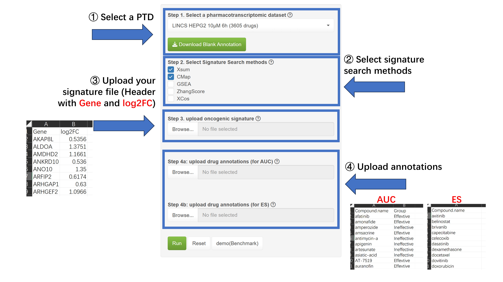
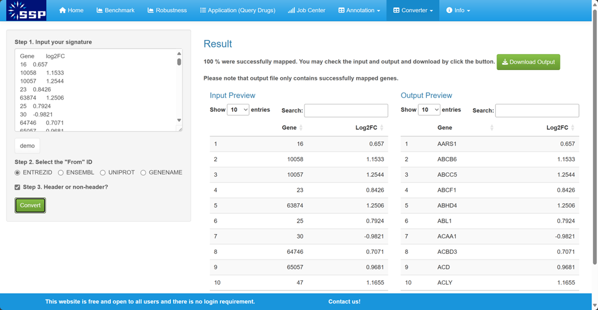
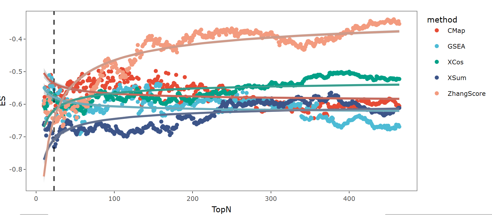
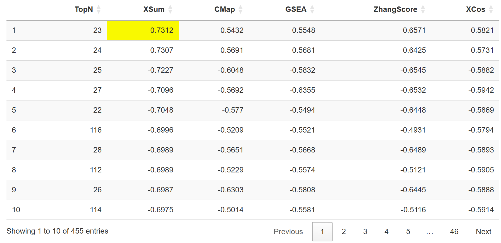

### How to use Benchmark and interpret the results? 
The **Benchmark** module aims to evaluate the performance of Signature Search Methods (SSMs) through pharmacotranscriptomic datasets and drug annotations. The results could tell us which method and topN (the number of gene used for SS) are the best.   
In this module, you can evaluate Signature Search Methods (SSMs) based on signatures and well-annotated drugs in LINCS.  
Please follow the steps below to perform job:   

**1. Select a pharmacotranscriptomic dataset.**  
**2. Select at least two SSMs for testing**  
**3. Upload a oncogenic signature representing a specific cancer.**   
**4. Upload at least one type Drug annotation file indicating the drug's efficacy in experiments or its approval status in clinic (e.g., FDA-approved).**    

#### Demo file provided   
Please be aware that oncogenic signature and drug annotation files can be accessed through the help button adjacent to the **steps in the left panel**.    

SSP also offer a package of demo files in Info-data page.  

#### Details of each step
**Pharmacotranscriptomic dataset**, originally sourced from LINCS L1000 (GSE92742), is presented in an n × m matrix where n represents the drug names and m denotes a list of gene symbols along with their corresponding log2FC values.   
The SSP incorporates pharmacotranscriptomic datasets encompassing nine tumor cell lines across various concentrations and treatment durations.     
Generally, it is advisable for users to select a pharmacotranscriptomic dataset rich in drugs and closely related to the cancer of interest. pharmacotranscriptomic datasets obtained at 6 hours with 10μM or at 24 hours with 10μM are commonly recommended.  
Utilizing multiple datasets is also recommended for users to enhance the reliability of the outcomes.  Drugs that are consistently ranked highly across different concentrations and treatment durations within pharmacotranscriptomic datasets have a higher likelihood of being effective.   

**A oncogenic signature** is a gene list header with **Gene** and **Log2FC**. It typically consists of differentially expressed genes derived from sequencing samples of cell or animal experiments, or patient cohorts, such as GEO, TCGA and ICGC.    
The oncogenic signature should contain **at least 10 genes exhibiting a log2FC > 0 and 10 genes exhibiting a log2FC < 0**. Notably, the genes provided by user should be in the format of gene symbol and are **statistically significant (adjust p-value < 0.05 or FDR < 0.05)**, ensuring the significance of further analysis.    

Should your oncogenic signature contain genes formatted with alternative identifiers (such as EntrezID, Ensembl, UniProt, Gene name, etc.), proceed to the Converter page for the necessary conversion.    

**Drug annotations** are commonly sourced from databases and resources such as ChEMBL, PubChem, scientific literature, clinical trials, and DrugBank. Users have two options: ① Download a blank annotation table and label it manually, or     

② Independently compile annotations from various sources and upload them into the Converter module to get a format-compatible annotation file.   

**Notably, the SSP employs two drug annotation metrics, AUC and ES, with users required to select at least one for the performance assessment of SSMs. Annotating every drug is impractical; nonetheless, an increased number of annotations leads to more precise outcomes.**  

*1. AUC*: The AUC aims to assess whether the SSM can effectively distinguish between effective and ineffective drugs. This metric is applicable to drug annotations derived from large-scale experimental screenings, such as determining drug efficacy based on whether IC~50~ value < 10μM.     
We recommend that the file comprises at least **50 drugs** and **clearly denotes both two categories of labels: 'Effective' and 'Ineffective'.)**.    
The file should appear as follows (header with **Compound_name** and **Group**) and upload in step 4a:    

Subsequently, drug scores will be computed and ranked based on the confusion matrix using the Area Under the Curve **(AUC)**, with **a higher AUC signifying superior performance**.   

*2. ES*: The ES aims to evaluate whether effective drugs can be well enriched at the top of the descending ordered drug list based on scores. This metric is suitable for drug annotations based on clinical practice (for example, FDA-approved drugs), where a minority of drugs are known to be effective, and the efficacy of the majority remains uncertain.      
We recommend that the file comprises at least **10 drugs**.   
The file should appear as follows and upload in step 4b:     

SSP will calculate drug scores and determine the **enrichment score (ES)**, with **a lower ES indicating enhanced performance**.    

**Additionally, the SSP provides a primary annotated drug list accessible through the Annotation Module.**   

#### Submission   
Ultimately, initiate the process by clicking 'Run,' which will generate a job ID (**jobid**) prefixed with 'BEN'. Results are typically available within approximately 15~30 minutes, and a 'Quick Tip' will be provided to assist with result interpretation. Alternatively, you may close the page and retrieve the job ID in the **Job Center**  for future result retrieval.   

#### Result interpretation
In result of AUC, the image is a scatter plot depicting the results of the **Area Under the Curve (AUC)** for different **signature search methods (SSMs)** across various TopN values. AUC is a metric used to evaluate the performance of SSMs, typically in drug efficacy classification tasks. There are five methods represented by different colored dots: **CMap (red)**, **GSEA (blue)**, **XCos (green)**, **XSum (purple)**, and **ZhangScore (orange)**. The AUC results for each method at different TopN values are plotted with the corresponding colored dots, with a smooth trend line for each method indicating the change in AUC as TopN increases.   
The vertical dashed line in the scatter plot indicates the position of the TopN value where the **maximum AUC** is achieved for one or more methods.  

In the corresponding table below, the row with the TopN value associated with the **maximum** is placed at the forefront, and the cell containing the **maximum value** is highlighted in yellow.  

**if you only upload a annotation for AUC, we recommend user select SSMs and topN with highest scores for later query in Application module. If the SSM in result exhibits monotonic increase, it is recommended to directly set the length of oncogenic signature to TopN for later query in Application module.**  
**if you upload both annotation for AUC and ES, we recommend user select SSMs and topN with relative high scores in both AUC and ES for later query in Application module. For example, topN in the top 10 of result ES and AUC is acceptable.**  
**if you want to use SS_cross, it is important to note that we recommend each oncogenic signature be evaluated in the Benchmark module. If the optimal topN and SSM for two oncogenic signatures are identical or close (with high scores in the same topN or a high ranking in SSM), this indicates a strong match. If not, it is advisable to replace the oncogenic signatures.** 
**if you want to use SS_all, just select the SSMs with high performance over minority in AUC.**   

In result of ES, the image is a scatter plot depicting the results of the **Enrichment Score (ES)** for different **signature search methods (SSMs)** across various TopN values. ES is a metric used to evaluate the performance of SSMs, typically in drug efficacy classification tasks. There are five methods represented by different colored dots: **CMap (red)**, **GSEA (blue)**, **XCos (green)**, **XSum (purple)**, and **ZhangScore (orange)**. The ES results for each method at different TopN values are plotted with the corresponding colored dots, with a smooth trend line for each method indicating the change in ES as TopN increases.   
The vertical dashed line in the scatter plot indicates the position of the TopN value where the **minimum ES** is achieved for one or more methods.  

In the corresponding table below, the row with the TopN value associated with the **minimum** is placed at the forefront, and the cell containing the **minimum value** is highlighted in yellow.  

**if you only upload a annotation for ES, we recommend user select SSMs and topN with lowest scores for later query in Application module. If the SSM in result exhibits monotonic decrease, it is recommended to directly set the length of oncogenic signature to TopN for later query in Application module.**  
**if you only upload a annotation for ES, we recommend user select SSMs and topN with lowest scores for later query in Application module. If the SSM in result exhibits monotonic decrease, it is recommended to directly set the length of oncogenic signature to TopN for later query in Application module.**  
**if you upload both annotation for AUC and ES, we recommend user select SSMs and topN with relative high scores in UC and low in ES for later query in Application module. For example, topN in the top 10 of result of ES and AUC is acceptable.**  
**if you want to use SS_cross, it is important to note that we recommend each oncogenic signature be evaluated in the Benchmark module. If the optimal topN and SSM for two oncogenic signatures are identical or close (with high scores in the same topN or a high ranking in SSM), this indicates a strong match. If not, it is advisable to replace the oncogenic signatures.** 
**if you want to use SS_all, just select the SSMs with high performance over minority in ES.**   