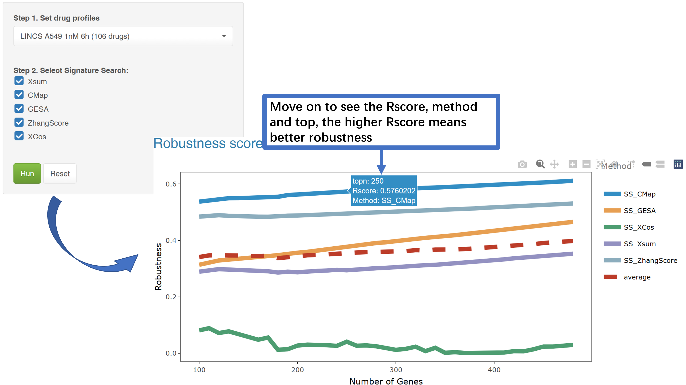

### How to use Robustness and interpret the results?  
The Robustness module enables the evaluation of signature search methods (SSMs) through the mechanism of drug self-retrieval.    
In the **Benchmark module**, we tested SSMs based on drug annotations.  
However, the drug repurposing of a rare cancer subtype can be challenging by insufficient drug annotations within pharmacotranscriptomic datasets (PTDs).   
Hence, we test the performance of SSMs based on **drug self-retrieval**.  
Drugs within the same pharmacotranscriptomic dataset in the LINCS L1000 dataset were assigned labels ranging from **1 to n**. For each drug, the top x up-regulated and top x down-regulated **(topN)** differentially expressed genes were extracted from its gene expression profile to form a signature.    
These signatures were then used to query one of the five SSMs, yielding **drug-drug metrics across all drugs**. Subsequently, by **varying topN and SSM, we obtained drug-drug metrics for each drug's signature derived from its expression profile under different SSMs and topN values within dataset**. We then identified the top two scoring drug-drug metrics. To assess the robustness of these methods across various topN values, we employed three parameters:   
**1. The correlation (R) between the input label and the top-ranked output label for all drugs, for example, drug1 input with drug1 top-ranked output, for specific topN and SSM.**   
**2. The mean difference between the top two scores (Score~top1~ – Score~top2~) across outputs for a specific topN and SSM.**   
**3. Standard deviation (SD) of all difference of top1 and top2 (Score~top1~ – Score~top2~) across outputs for a specific topN and SSM.**   
Finally, the Performance score can be expressed by the following formula:  

$$ 
performance \ score = \frac{Mean × R}{SD} 
$$

SSM and topN can be considered to have achieved satisfactory performance **if they can accurately identify the input active drug (stronger correlation), effectively differentiate between drugs (higher difference score), and demonstrate good stability (lower SD).** Hence, **a higher score means a better SSM and a suitable topN.** In this study, performance scores were evaluated for x values ranging from 10 to 480 in increments of 10.   

Select a PTD to review the performance of SSMs, and a 'Quick Tip' will be available for result interpretation.  

As shown in the figure, a higher **performance score** indicates greater robustness, indicating that the method is more accurate.  
**We recommend user select SSMs and topN with highest scores for later query in Application module. If the scores continue to increase with increasing topN, it is recommended to directly set the length of OGS to TopN for later query in Application module. For example, if an oncogenic signature contains 50 up-regulated genes and 35 down-regulated genes, please set topN to 50. However, in most dataset, the score  reaches a summit and gradually go down.**    
**If the length of OGS is less than topN, please select the optimal SSMs and topN with the relative high scores between 10 and length of OGS. If the user want to select mutible SSMs for SS_all, the performance score over the average score is highly recommended.**  
Robustness module may differ from that in the Benchmark module. Researchers are strongly encouraged to utilize the Benchmark module, in alignment with their specific fields of study. Should the number of topN genes from the Robustness module exceed the length of the OGS, it is recommended to assess whether the scores obtained from the Robustness module at the corresponding length are close to the optimal values. If not, consideration should be given to replacing the OGS.  
