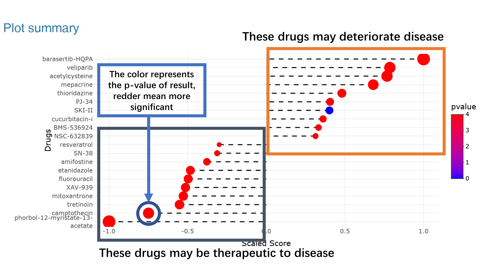
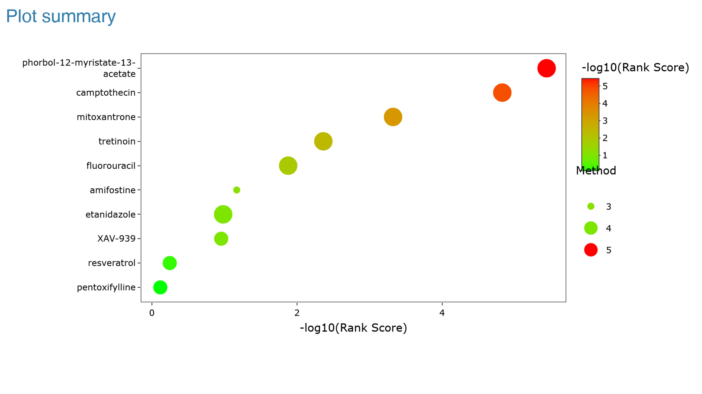
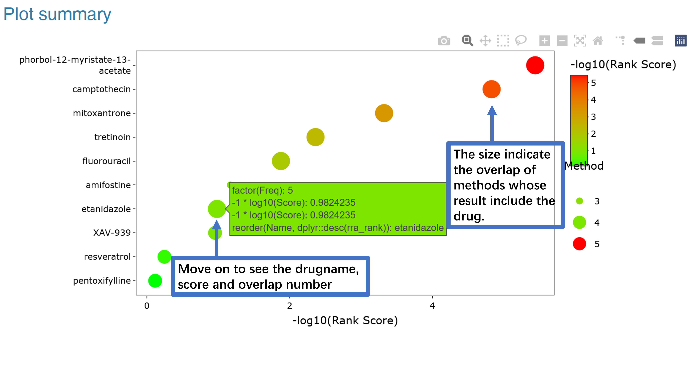
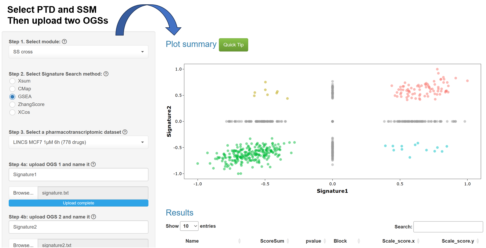
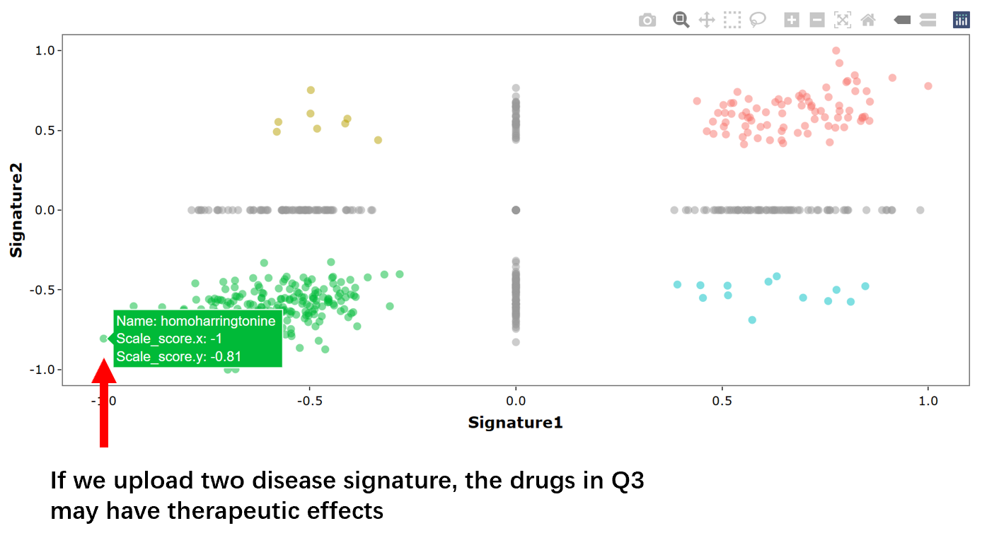

### How to query drug in Application and interpret the results?
Once we have determined the optimal SS method and topN, we can upload a disease signature and choose the module (Single Method, SS_all, SS_cross) to identify promising drugs.
Within the application module, we offer three tools for discovering drugs based on disease signatures.  
**The single method is a conventional search technique where users can upload a disease signature, select a profile set, and one SS method. The outcomes will present drugs with scores. >0 signifies that the drug could exacerbate the disease, while <0 suggests that it may mitigate the disease.**  
The results are depicted in a dotplot.  

Moreover, the SS_all module and SS_cross were devised to incorporate the signature search techniques to investigate active drugs.  
For the SS_all module, we aggregate drug ranks in the same direction (>0 or <0 for disease signature) using robust rank aggregation and assign an overall score (0~1) to each active ingredient. Hence, lower overall scores indicate greater significance across all methods.

Furthermore, this method is appropriate for identifying drugs with polypharmacological effects based on multiple signatures.

For the SS_cross module, we can compute the scores of drugs for two disparate pharmacological signatures \\(Score_{sig1}\\) and \\(Score_{sig2}\\) via a specific signature search method.Then, drugs were divided into four quadrants based on the scores (Q1: both scores >0, 
Q2: \\(Score_{sig1}\\) >0 but \\(Score_{sig2}\\) <0, 
Q3: both scores <0, 
Q4: \\(Score_{sig1}\\) <0 but \\(Score_{sig2}\\) >0).  
Finally, we compute an integrated score by taking the square root of the absolute values:
$$ 
Score_{mean} =  \\sqrt{ abs(Score_{sig1} \\times Score_{sig2}) }
$$

