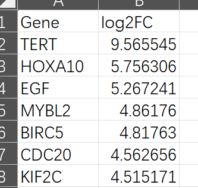
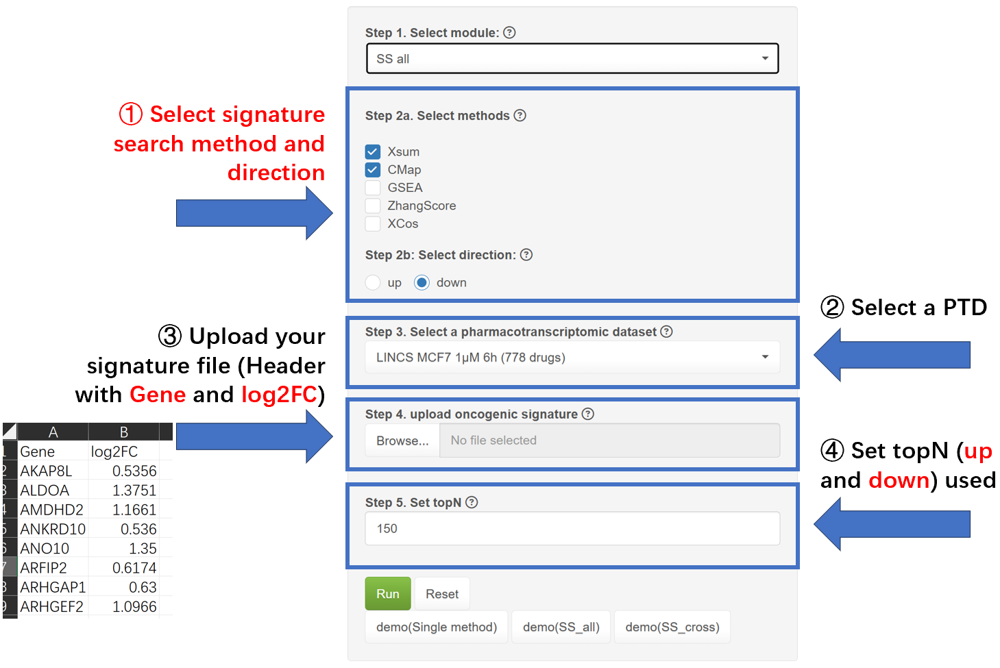
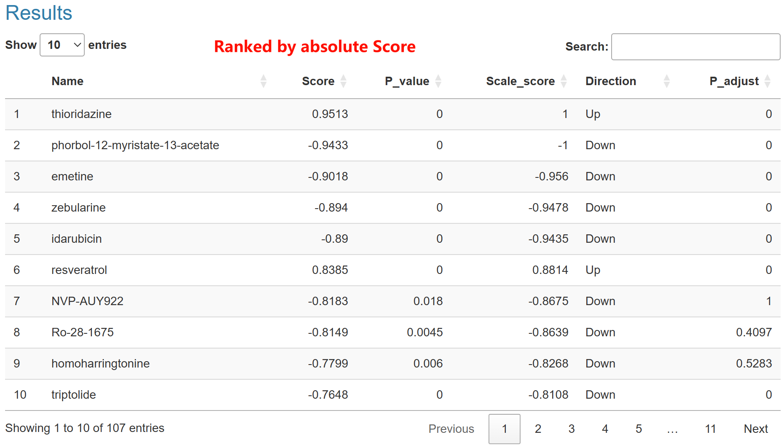

### How to query drug in Application and interpret the results?
In this module, you can apply Signature Search methods (SSMs) to query promising drugs based on the OGS.   
**A oncogenic signature (OGS)** is a gene list header with **Gene** and **Log2FC**. It typically consists of differentially expressed genes derived from sequencing samples of cell or animal experiments, or patient cohorts, such as GEO, TCGA and ICGC.    
Notably, It should contains **at least 10 genes exhibiting a log2FC > 0 and 10 < 0**. In addition, SSP accepts the genes in the format of **gene symbol** and assumes that input genes in OGS are **statistically significant (adjust p < 0.05)**.   

Should your OGS contain genes formatted with alternative identifiers (such as EntrezID, Ensembl, UniProt, Gene name, etc.), proceed to the Converter page for the necessary conversion.    

Below are three approaches to identify promising drugs:    

  

As shown in the picture:   
1. **Single method** : This approach queries drugs using a single SSM, adhering to the conventional method. Typically, a filter for differentially expressed genes (DEGs) is applied using abs(log2FC) > ±1.  
2. **SS_cross** : This approach queries drugs using two signatures and ranks them based on overall scores (Score~Sum~). SS_Cross is designed to discover drugs with consensus between two OGS. if the OGS is related to specific pharmacological effects(for example, two OGS were generated from experiment treated with different drugs), these drugs prioritizing in results may be polypharmacological.  
3. **SS_all** : This approach queries drugs across various SSMs and ranks them uniformly (either up or down) using Robust Rank Aggregation (RRA). SS_All considers all selected SSMs to identify the **greatest common drugs**.

**Each approach entails distinct steps:**  

For the **Single Method**, the following four steps are required:  
① Choose the desired SSM,  
② Select a pharmacotranscriptomic dataset (PTD),  
③ Upload the **signature file (header with 'Gene' and 'log2FC')**, and  
④ Determine the number of top genes (topN) to utilize, with guidance provided by the Benchmark or Robustness modules.  

For **SS_cross**, step ③ differs:  
Two OGS files, along with their respective names, are necessary; the name of the first signature corresponds to the X-axis, while the second corresponds to the Y-axis in the resulting figure.     

For **SS_all**, step ① varies:    
You may choose a selection of SSMs and a ranking direction for the drugs. Generally, if an oncogenic signature is uploaded, select **'down'**.   

Ultimately, initiate the process by clicking 'Run,' which will generate a job ID (**jobid**) prefixed with 'APP'. Results are typically available within approximately 15~30 minutes, and a 'Quick Tip' will be provided to assist with result interpretation. Alternatively, you may close the page and retrieve the job ID in the **Job Center**  for future result retrieval.   

#### Result interpretation

The single method is a classic drug repurposing method. One oncogenic signature and one signature search method (SSM) are required to retrieve drugs. 
In result of SS_all, here is a lollipop with colored dots representing Top10 drugs from pharmacotranscriptomic dataset (PTD). For better readability, we use logP to color the dot.  

In the corresponding table below, Here are four columns:  
**Name**: Drug name in pharmacotranscriptomic dataset (PTD).     
**Score**: Score of drugs computed by SSM.
**Scale_score**:  Score are scaled from -1 to 1 for better comparison.  
**pvalue**: p value of drugs computed by SSM using a null distribution. For every PTD and SSM, we construct a corresponding null distribution by randomly sampling gene expression values and gene names from the PTD data. This process is iterated to generate 2000 null signatures, which are then scored using corresponding SSM.
**p.adjust**: adjust p value of drugs computed by SSM. 
**Direction**: the drug show potential to input signature. In breif, <0 means "down" and >0 means "up".

Generally, Since SSP accepts input of oncogenic signatures, **drugs with score >0 may be agonistic to cancer, drugs with score <0 may be therapeutically beneficial against cancer.**    
Of note, table reordered the drugs by absolute value of Scores, rather than scaled scores, so that the top drugs may be sometimes polarized in up (>0) or down (<0). It is used when evaluate the overall response of signature. For example, if drugs of a specific PTD response to the oncogenic signature with mainly positive scores, the concentration and treat time may be inappropriate for further investigation.  

SS_all compute signature across various signature search methods (SSMs) and generated prioritized drugs in same direction (up or down, it depends on user's choice). Subsequently, these drugs along with their respective ranks are incorporated into the [Robust Rank Aggregation (RRA)](https://doi.org/10.1093/bioinformatics/btr709) methodology. RRA is used to discern drugs that exhibit a consistently superior ranking compared to what would be expected under the null hypothesis of uncorrelated inputs. It further assigns a significance score for each drug, thereby providing a rigorous statistical basis for the prioritization.  
The RRA compute the significance of each drug, just like p-value and we convert it into score by logP.  
In result of SS_all, here is a scatter plot with colored dots representing Top10 drugs, and a legend showing the drugs' scores. These drugs are promising based on the input signature.

In the corresponding table below, Here are four columns:  
**Name**: the name of drugs ranked by Score.    
**Score**: the score computed by SS_cross.    
**Freq**: the number of SSM where the drugs are enriched in up (score of SSM > 0) or down (score of SSM < 0).  
**Method**:  the name SSM where the drugs are enriched.  

Generally, a drug with more SSMs enriched and the higher score are more promising.  

SS_cross evaluate the polypharmacological effect of drugs. It computes the scores of drugs for two disparate OGS Score~sig1~ and Score~sig2~ via a specific SSM. Then these drugs are classified into four quadrant: 
Q1: both scores >0,   
Q2: Score~sig1~ >0 but Score~sig2~ <0,   
Q3: both scores <0,   
Q4: Score~sig1~ <0 but Score~sig2~ >0).    
Finally, It compute an integrated score (Score~sum~) by taking the square root of the absolute values:
$$ 
Score_{overall} =  \\sqrt{ abs(Score_{sig1} \\times Score_{sig2}) }
$$

In result of SS_all, here is a scatter plot with colored dots representing drugs from pharmacotranscriptomic dataset (PTD). These drugs are denoted in four quadrants: **Q1 (both >0) colored pink**,**Q2 (x-axis <0 but y-axis >0) colored dark Khaki**, **Q3(both <0) colored green**, **Q4 (x-axis <0 but y-axis >0) colored dark Cyan**, notably, if a drug has a score of zero, it would be on the axis and colored grey.  

In the corresponding table below, Here are four columns:  
**Name**: the name of drugs ranked by ScoreSum.  
**ScoreSum**: The metric ScoreSum is defined as the arithmetic square root of the product of the absolute values of two scores.  
**pvalue**: the nominpal p value based on the two p values of drugs compute by SSM. We use Fisher's method to combine the two pvalue and get a nominal p value.  
**Scale_score.x** and **Scale_score.y**: two scores of drugs compute by SSM.  

Generally, Since SSP accepts input of oncogenic signatures, which represent the status of different cancer cohorts or oncogenic processes, each quadrant in SS_cross carries a distinct interpretation: **Q1 (both >0) signifies drugs that are agonistic to two oncogenic signatures, Q2 (x-axis <0 but y-axis >0) and Q4 (x-axis <0 but y-axis >0) denote drugs that are agonistic to one oncogenic signature but potentially therapeutic for another. Q3 (both <0) represents drugs that may be therapeutically beneficial against oncogenic signatures**. Consequently, **drugs in Q3 are recommended for repurposing**.   
In addition, if you want to use this figure with drug of interest, we highly recommend you download the picture and label them manually.    
