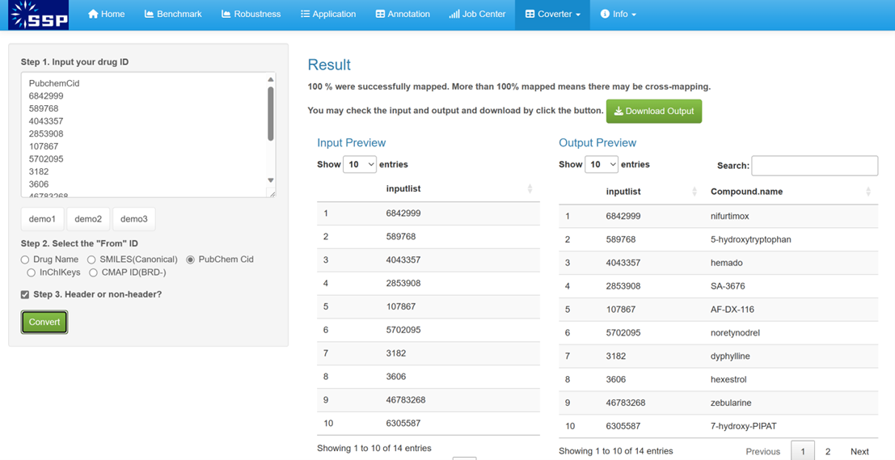

### How to annotate drugs?
Drug annotations are commonly sourced from databases and resources such as ChEMBL, PubChem, scientific literature, clinical trials, and DrugBank. Users have two options: ① Download a blank annotation table and label it manually, or     

② Independently compile annotations from various sources and upload them into the Converter module to get a format-compatible annotation file.   

The principle of annotation is related to the cancer you are studying. For example, if you are interesting in liver cancer, you may need download blank annotation of **LINCS_A375/A549_10μM/5μM_24h/12h/6h** to collect annotation on whether a drug is effective against liver cancer. These annotations can generally be obtained based on clinical trials (experimental / approved / failed) or cell experiments (IC50 < 10 μM).   
Clinical trials info can be found on [DrugBank](https://go.drugbank.com/) or [Clinical Trials](https://classic.clinicaltrials.gov/). The IC50 of drugs could be found on [PubChem](https://pubchem.ncbi.nlm.nih.gov/) or [ChEMBL](https://www.ebi.ac.uk/chembl/). Also, also we provide annotation module for an primary drug annotation.  
We highly recommend accurate annotation of a specific disease and do not forget to **remove unannotated drugs** in blank annotation file.