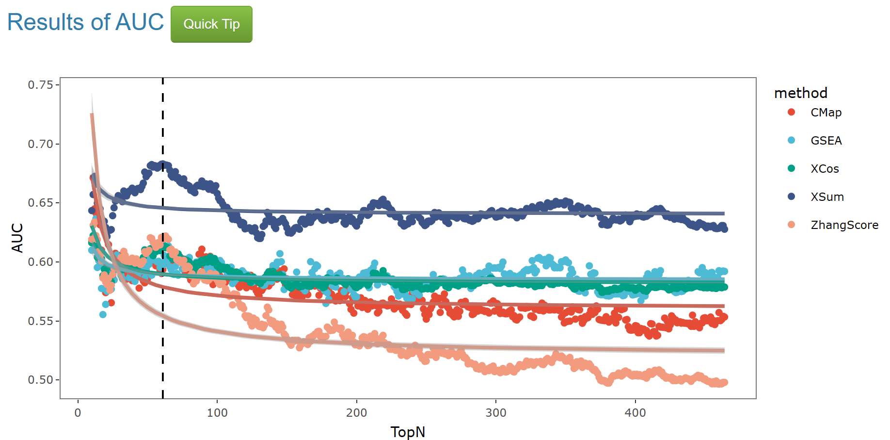
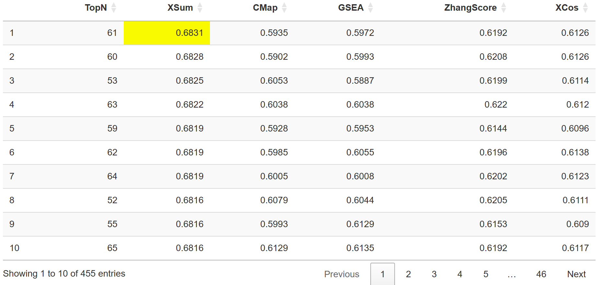

In the presentaion of result, you can see at least one plot and one table.  
If you provide annotation of AUC, you will see the result of AUC and the same to ES.    
In result of AUC, the image is a scatter plot depicting the results of the **Area Under the Curve (AUC)** for different **signature search methods (SSMs)** across various TopN values. AUC is a metric used to evaluate the performance of SSMs, typically in drug efficacy classification tasks. There are five methods represented by different colored dots: **CMap (red)**, **GSEA (blue)**, **XCos (teal)**, **XSum (dark blue)**, and **ZhangScore (orange)**. The AUC results for each method at different TopN values are plotted with the corresponding colored dots, with a smooth trend line for each method indicating the change in AUC as TopN increases.   
The vertical dashed line in the scatter plot indicates the position of the TopN value where the **maximum AUC** is achieved for one or more methods.  

In the corresponding table below, the row with the TopN value associated with the **maximum** is placed at the forefront, and the cell containing the **maximum value** is highlighted in yellow.  

