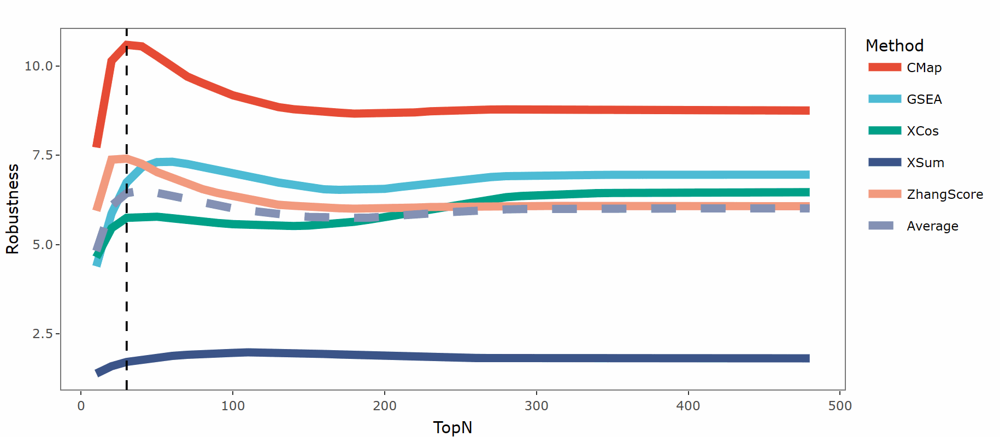
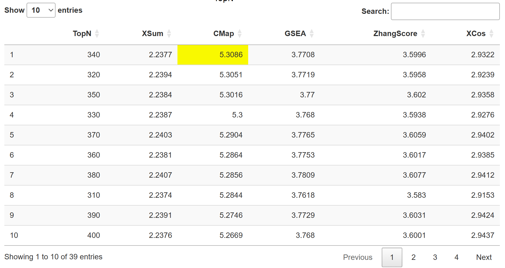

In the presentaion of result, you can see one plot and one table.  
The plot shows the results of the **robustness scores** for different **signature search methods (SSMs)** across various TopN values.
robustness scores is a metric used to evaluate the performance of SSMs, previouly introduced in [our work](https://doi.org/10.1093/bib/bbad027).  
There are five methods represented by different colored dots: **CMap (red)**, **GSEA (blue)**, **XCos (green)**, **XSum (purple)**, and **ZhangScore (orange)**. In addition, a **slightly desaturated blue dashed line** is added to represent the **average score**. The robustness results for each method at different TopN values are plotted with the corresponding colored dots, with a smooth trend line for each method indicating the change in robustness scores as TopN increases.   

The vertical dashed line in the scatter plot indicates the position of the TopN value where the **maximum robustness scores** is achieved for one or more methods.  

In the corresponding table below, the row with the TopN value associated with the **maximum** is placed at the forefront, and the cell containing the **maximum value** is highlighted in yellow.  

**We recommend user select SSMs and topN with highest scores for later query in Application module. If the scores continue to increase with increasing topN, it is recommended to directly set the length of oncogenic signature to TopN for later query in Application module. For example, if an oncogenic signature contains 50 up-regulated genes and 35 down-regulated genes, please set topN to 50. However, in most dataset, the score  reaches a summit and gradually go down.**    
**If the length of oncogenic signature is less than topN, please select the optimal SSMs and topN with the relative high scores between 10 and length of oncogenic signature. If the user want to select mutiple SSMs for SS_all, the performance score over the average score is highly recommended.**  
Robustness module may differ from that in the Benchmark module. Researchers are strongly encouraged to utilize the Benchmark module, in alignment with their specific fields of study. Should the number of topN genes from the Robustness module exceed the length of the oncogenic signature, it is recommended to assess whether the scores obtained from the Robustness module at the corresponding length are close to the optimal values. If not, consideration should be given to replacing the oncogenic signature.  
