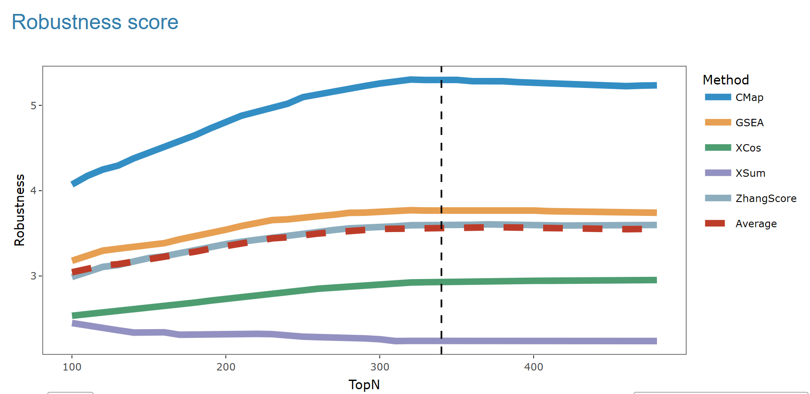

In the presentaion of result, you can see one plot and one table.  
The plot shows the results of the **robustness scores** for different **signature search methods (SSMs)** across various TopN values.
robustness scores is a metric used to evaluate the performance of SSMs, previouly introduced in [our work](https://doi.org/10.1093/bib/bbad027).  
There are five methods represented by different colored dots: **CMap (red)**, **GSEA (blue)**, **XCos (green)**, **XSum (purple)**, and **ZhangScore (orange)**. In addition, a **slightly desaturated blue dashed line** is added to represent the **average score**. The AUC results for each method at different TopN values are plotted with the corresponding colored dots, with a smooth trend line for each method indicating the change in robustness scores as TopN increases.   

The vertical dashed line in the scatter plot indicates the position of the TopN value where the **maximum robustness scores** is achieved for one or more methods.  

In the corresponding table below, the row with the TopN value associated with the **maximum** is placed at the forefront, and the cell containing the **maximum value** is highlighted in yellow.  

