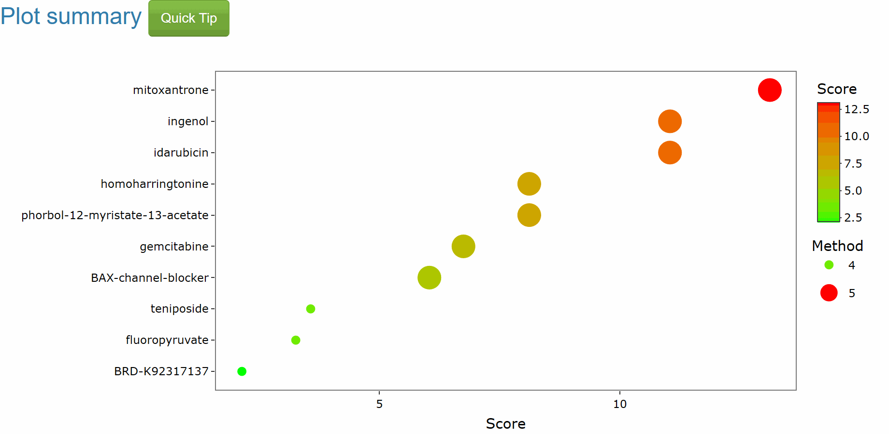
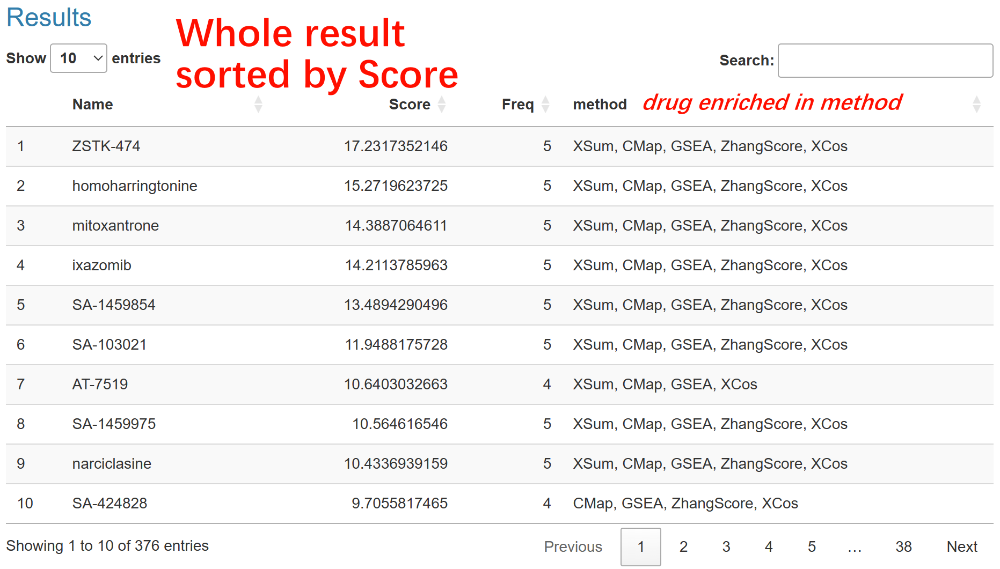

SS_all compute signature across various signature search methods (SSMs) and generated prioritized drugs in same direction (up or down, it depends on user's choice). Subsequently, these drugs along with their respective ranks are incorporated into the [Robust Rank Aggregation (RRA)](https://doi.org/10.1093/bioinformatics/btr709) methodology. RRA is used to discern drugs that exhibit a consistently superior ranking compared to what would be expected under the null hypothesis of uncorrelated inputs. It further assigns a significance score for each drug, thereby providing a rigorous statistical basis for the prioritization.  
The RRA compute the significance of each drug, just like p-value and we convert it into score by logP.  
In result of SS_all, here is a scatter plot with colored dots representing Top10 drugs, and a legend showing the drugs' scores. These drugs are promising based on the input signature.

In the corresponding table below, Here are four columns:  
**Name**: the name of drugs ranked by Score.    
**Score**: the score computed by SS_cross.    
**Freq**: the number of SSM where the drugs are enriched in up (score of SSM > 0) or down (score of SSM < 0). In the plot, it corresponds to the "method," where the number of methods is represented by the size of the bubbles.  
**Method**:  the name SSM where the drugs are enriched.  

Generally, a drug with more SSMs enriched and the higher score are more promising.  
