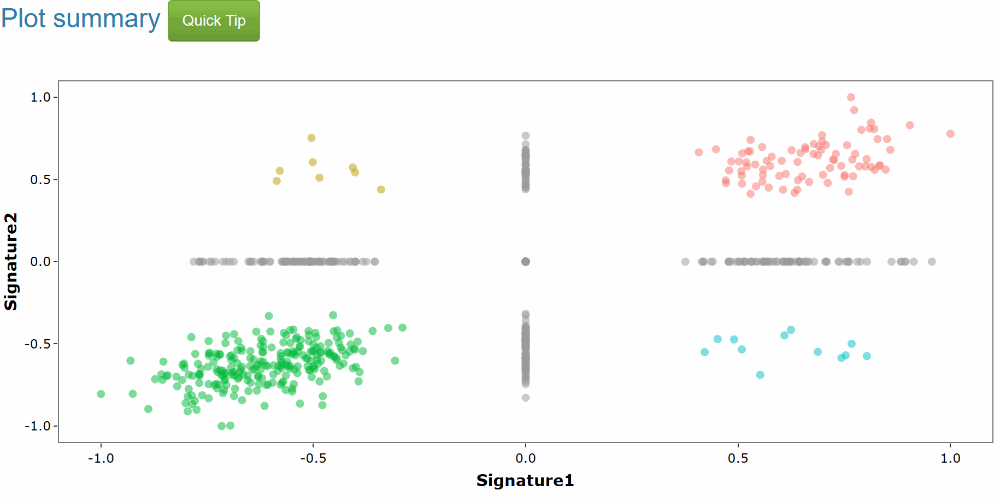
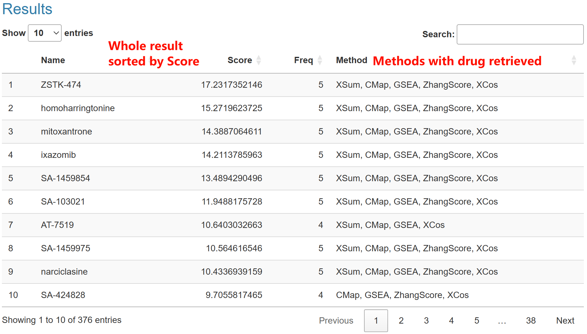

SS_cross evaluate the polypharmacological effect of drugs. It computes two signatures with one signature search method (SSM) and then classified into four quadrant based on the sign (>0 or <0) of score of each drugs.  
In result of SS_all, here is a scatter plot with colored dots representing drugs from pharmacotranscriptomic dataset (PTD). These drugs are denoted in four quadrants: **Q1 (both >0) colored pink**,**Q2 (x-axis <0 but y-axis >0) colored dark Khaki**, **Q3(both <0) colored green**, **Q4 (x-axis <0 but y-axis >0) colored dark Cyan**, notably, if a drug has a score of zero, it would be on the axis and colored grey.  

In the corresponding table below, Here are four columns:  
**Name**: the name of drugs ranked by ScoreSum.  
**ScoreSum**: The metric ScoreSum is defined as the arithmetic square root of the product of the absolute values of two scores.  
**pvalue**: the nominpal p value based on the two p values of drugs compute by SSM. We use Fisher's method to combine the two pvalue and get a nominal p value.  
**Scale_score.x** and **Scale_score.y**: two scores of drugs compute by SSM.  

Generally, Since SSP accepts input of oncogenic signatures, which represent the status of different cancer cohorts or oncogenic processes, each quadrant in SS_cross carries a distinct interpretation: **Q1 (both >0) signifies drugs that are agonistic to two oncogenic signatures, Q2 (x-axis <0 but y-axis >0) and Q4 (x-axis <0 but y-axis >0) denote drugs that are agonistic to one oncogenic signature but potentially therapeutic for another. Q3 (both <0) represents drugs that may be therapeutically beneficial against oncogenic signatures**. Consequently, **drugs in Q4 are recommended for repurposing**.   
In addition, if you want to use this figure with drug of interest, we highly recommend you download the picture and label them manually.    

