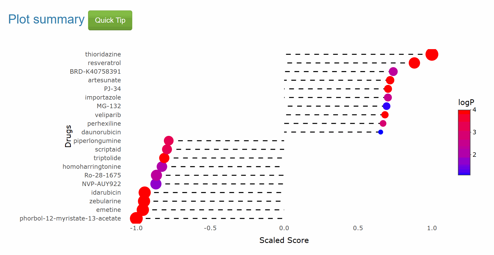

The single method is a classic drug repurposing method. One oncogenic signature and one signature search method (SSM) are required to retrieve drugs. 
In result of SS_all, here is a lollipop with colored dots representing Top10 drugs from pharmacotranscriptomic dataset (PTD). For better readability, we use logP to color the dot.  

In the corresponding table below, Here are four columns:  
**Name**: Drug name in pharmacotranscriptomic dataset (PTD).     
**Score**: Score of drugs computed by SSM.
**Scale_score**:  Score are scaled from -1 to 1 for better comparison.  
**pvalue**: p value of drugs computed by SSM using a null distribution. For every PTD and SSM, we construct a corresponding null distribution by randomly sampling gene expression values and gene names from the PTD data. This process is iterated to generate 2000 null signatures, which are then scored using corresponding SSM.
**p.adjust**: adjust p value of drugs computed by SSM. 
**Direction**: the drug show potential to input signature. In breif, <0 means "down" and >0 means "up".

Generally, Since SSP accepts input of oncogenic signatures, **drugs with score >0 may be agonistic to cancer, drugs with score <0 may be therapeutically beneficial against cancer.**    
Of note, table reordered the drugs by absolute value of Scores, rather than scaled scores, so that the top drugs may be sometimes polarized in up (>0) or down (<0). It is used when evaluate the overall response of signature. For example, if drugs of a specific PTD response to the oncogenic signature with mainly positive scores, the concentration and treat time may be inappropriate for further investigation.  

