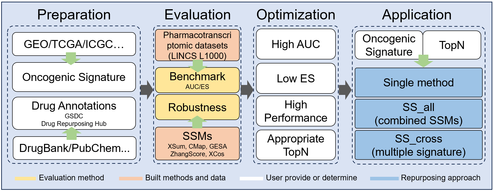

**Signature Search Polestar (SSP)** is a webserver that integrates the largest uniform pharmacotranscriptomic datasets from LINCS L1000 with five state-of-the-art Signature Search methods (SSMs). SSP allows users to evaluate these SSMs using cancere-drug similarity metrics and drug annotations, and suggests the optimal method and appropriate topN to construct a customized oncogenic signature. Additionally, SSP offers three effective approaches to query drugs for new repurposing based on specific oncogenic signature.    

**For new user, here is a brief introduction for you.**   
SSP is structured around **three primary modules** and **four auxiliary modules**. You can access the respective modules by clicking on the navigation bar buttons or the module buttons on the home page.    
   

Each module is accompanied by a detailed guide on the right panel.   
The primary modules, which are essential for drug repurposing, consist of the following:   
**Benchmark**: This module evaluates the performance of each SSM based on the user-provided oncogenic signature and drug annotations. It helps in determining the appropriate SSM and topN for further analysis.
**Robustness**: Designed for researching rare subtype cancers where there might be insufficient drug annotations, this module uses drug-self retrieval to assess the performance of each SSM and establish the suitable SSM and topN.   
**Application**: After identifying the appropriate SSM and topN through Benchmark and Robustness, users can upload file and set parameters into the Application module for drug repurposing.      

The four auxiliary modules primarily support the aforementioned primary modules by offering functionalities such as data preprocessing and result retrieval:  
**Job Center**: A jobid is provided after successful submission in benchmark and application module. This module enable user to retrieves the results of computations. Demo result and interpretation are also provided.    
**Annotation**: Provides an preliminary curated annotation data for a variety of drugs and cancers. This module aims to reduce users' burden of manual curation. these annotation could be used in Benchmark.          
**Converter**: Facilitates the conversion of gene and drug identifiers into formats compatible with the Benchmark and Application.  
**Info**: Offers **help pages, demo files, scripts, supplementary document** and **organized pharmacotranscriptomic datasets** for users' convenience and ease of use.  

We strongly recommend that users first visit the **Benchmark module** or the **Info-Help page** to understand the  operational procedures and file requirements before preparing your work.  
For any inquiries, please click on the **"Contact us!"** link at the bottom of the website page for email consultation.
