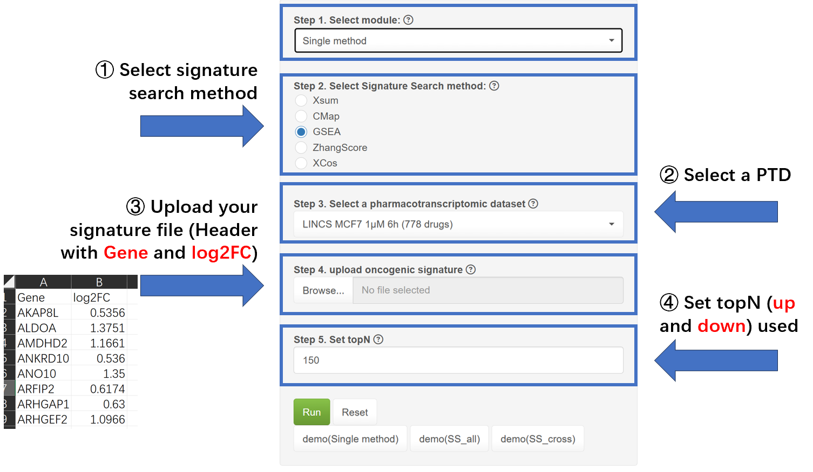
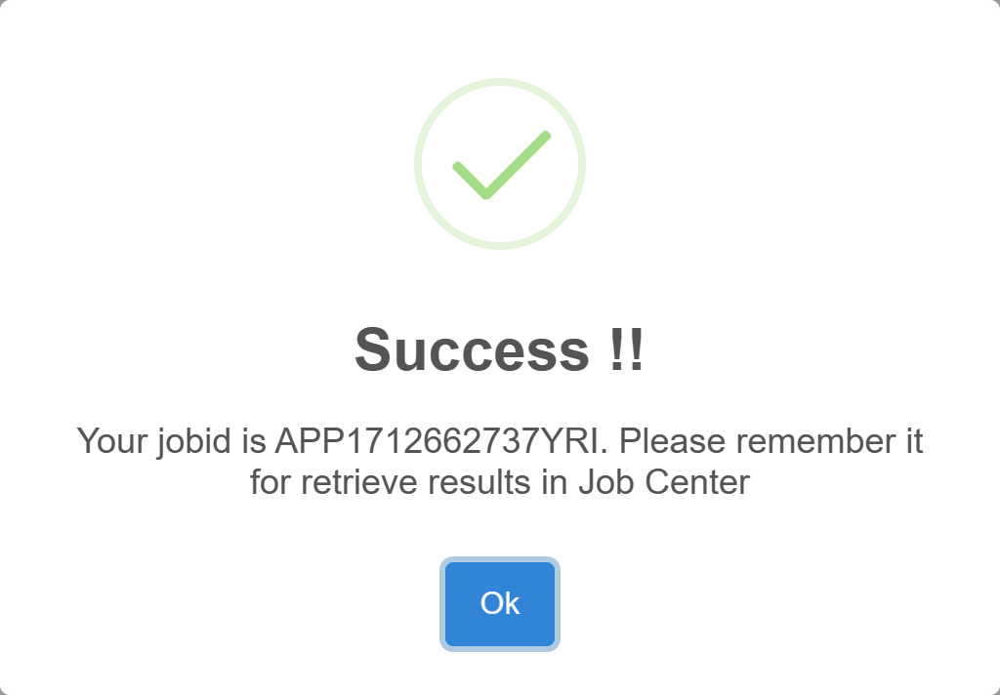

### Welcome to Application module! 
#### For demo results, please go to the Job Center page.  
In this module, you can apply Signature Search methods (SSMs) to query drugs based on the signature input.   
**SSP assumes that input oncogenic signatures are statistically significant (p < 0.05) by default, ensuring their relevance for further analysis.**  
Here we provide three ways to find promising drugs:  

  

As shown in the picture:
1. **Single method** : Single method: Query drugs using one SSM, as the **traditional way**. Typically, **abs(logFC) > ±1** is used for filter differentially expressed genes.  
2. **SS_cross** : Query drugs using **two signatures** and rank them by overall scores (ScoreSum). SS_cross aims to found polypharmacological drugs.
3. **SS_all** : Query drugs across multiple SS methods and rank them in the same direction (up or down) using robust rank aggregation (RRA), SS_all takes all SSM into account and found the **greatest common drugs**.  
**Different way requires different steps:**  

For the **Single method**, we need four steps:  
① Select a desired SSM,  
② Select one pharmacotranscriptomic dataset (PTD),  
③ Upload your **signature file (header with 'Gene' and 'log2FC')**, and  
④ Set how many top genes (up and down) to use, it may be hinted from the benchmark module or robustness module.  

For **SS_cross**, step ③ is different:  
two signature files and their names are required, the name of the first signature represents the X axis, and the second represents the Y axis in the result figure.   

For **SS_all**, step ① is different:    
you can select some methods and a direction to rank the drugs, generally, if you upload an oncogenic signature, choose **'down'**; otherwise, choose **'up'**.   

Finally, click the "Run" button and you will get a **jobid** in Job Center for result inquiry later.

For more information, please visit the **Info-Help** page.  
