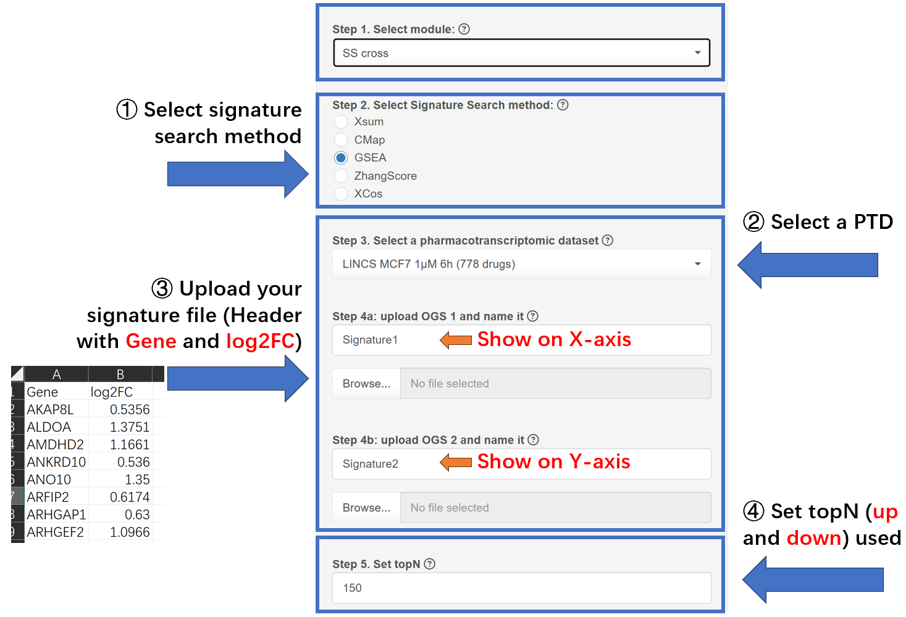

### Welcome to the Application module! 
In this module, you can apply Signature Search methods (SSMs) to query promising drugs based on the OGS.   
**A oncogenic signature (OGS)** is a gene list header with **Gene** and **Log2FC**. It typically consists of differentially expressed genes derived from sequencing samples of cell or animal experiments, or patient cohorts, such as GEO, TCGA and ICGC.    
The oncogenic signature should contain **at least 10 genes exhibiting a log2FC > 0 and 10 genes exhibiting a log2FC < 0**. Notably, the genes provided by user should be in the format of gene symbol and are **statistically significant (adjust p-value < 0.05 or FDR < 0.05)**, ensuring the significance of further analysis. 

Should your OGS contain genes formatted with alternative identifiers (such as EntrezID, Ensembl, UniProt, Gene name, etc.), proceed to the Converter page for the necessary conversion.    

Below are three approaches to identify promising drugs:    

  

As shown in the picture:   
1. **Single method** : This approach queries drugs using a single SSM, adhering to the conventional method. Typically, a filter for differentially expressed genes (DEGs) is applied using abs(log2FC) > ±1.  
2. **SS_cross** : This approach queries drugs using two signatures and ranks them based on overall scores (Score~Sum~). The purpose of SS_cross is to identify drugs that exhibit same strong response across two distinct oncogenic signatures. This aligns with the current practice in omics data mining, where findings typically require validation across multiple datasets.    
3. **SS_all** : This approach queries drugs across various SSMs and ranks them uniformly (either up or down) using Robust Rank Aggregation (RRA). SS_All considers all selected SSMs to identify the **greatest common drugs**.

**Each approach entails distinct steps:**  

For the **Single Method**, the following four steps are required:  
① Choose the desired SSM,  
② Select a pharmacotranscriptomic dataset (PTD),  
③ Upload the **signature file (header with 'Gene' and 'log2FC')**, and  
④ Determine the number of top genes (topN) to utilize, with guidance provided by the Benchmark or Robustness modules.  

For **SS_cross**, step ③ differs:  
Two OGS files, along with their respective names, are necessary; the name of the first signature corresponds to the X-axis, while the second corresponds to the Y-axis in the resulting figure.     

For **SS_all**, step ① varies:    
You may choose a selection of SSMs and a ranking direction for the drugs. Generally, if an oncogenic signature is uploaded, select **'down'**.Other type signature is not recommended. **For more details, please refer to the help page, specifically Question 8.**    

Ultimately, initiate the process by clicking 'Run,' which will generate a job ID (**jobid**) prefixed with 'APP'. Results are typically available within approximately 15~30 minutes, and a 'Quick Tip' will be provided to assist with result interpretation. Alternatively, you may close the page and retrieve the job ID in the **Job Center**  for future result retrieval.   

For more information, please visit the **Info-Help** page.  
