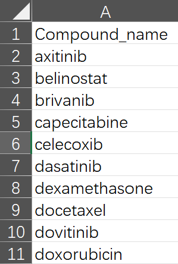

### Welcome to the Benchmark Module!   
In this module, you can evaluate Signature Search Methods (SSMs) based on signatures and well-annotated drugs in LINCS.  
Please follow the steps below to perform job:   

**1. Select a pharmacotranscriptomic dataset (PTD).**  
**2. Select at least two SSMs for testing**  
**3. Upload a oncogenic signature (OGS) representing a specific cancer.**   
**4. Upload at least one type Drug annotation file indicating the drug's efficacy in experiments or its approval status in clinic (e.g., FDA-approved).**    

#### Demo file provided   
Please be aware that OGS and drug annotation files can be accessed through the help button adjacent to the **steps in the left panel**.    

SSP also offer a package of demo files in Info-data page.  

#### Details of each step
**Pharmacotranscriptomic dataset (PTD)**, originally sourced from LINCS L1000 (GSE92742), is presented in an n × m matrix where n represents the drug names and m denotes a list of gene symbols along with their corresponding log2FC values.   
The SSP incorporates PTDs encompassing nine tumor cell lines across various concentrations and treatment durations.     
Generally, it is advisable for users to select a PTD rich in drugs and closely related to the cancer of interest. PTDs obtained at 6 hours with 10μM or at 24 hours with 10μM are commonly recommended.  
Utilizing multiple datasets is also recommended for users to enhance the reliability of the outcomes.  Drugs that are consistently ranked highly across different concentrations and treatment durations within PTDs have a higher likelihood of being effective.   

**A oncogenic signature (OGS)** is a gene list header with **Gene** and **Log2FC**. It typically consists of differentially expressed genes derived from sequencing samples of cell or animal experiments, or patient cohorts, such as GEO, TCGA and ICGC.    
The oncogenic signature should contain **at least 10 genes exhibiting a log2FC > 0 and 10 genes exhibiting a log2FC < 0**. Notably, the genes provided by user should be in the format of gene symbol and are **statistically significant (adjust p-value < 0.05 or FDR < 0.05)**, ensuring the significance of further analysis. 

Should your OGS contain genes formatted with alternative identifiers (such as EntrezID, Ensembl, UniProt, Gene name, etc.), proceed to the Converter page for the necessary conversion. **Please note that the Converter module only returns genes that are within the PTDs.**  

**Drug annotations** are commonly sourced from databases and resources such as ChEMBL, PubChem, scientific literature, clinical trials, and DrugBank. Users have two options: ① Download a blank annotation table and label it manually, or     

② Independently compile annotations from various sources and upload them into the Converter module to get a format-compatible annotation file. **Please note that the Converter module only returns drugs that are within the PTDs.**   

**Notably, the SSP employs two drug annotation metrics, AUC and ES, with users required to select at least one for the performance assessment of SSMs. Annotating every drug is impractical; nonetheless, an increased number of annotations leads to more precise outcomes.**  

*1. AUC*: The AUC aims to assess whether the SSM can effectively distinguish between effective and ineffective drugs. This metric is applicable to drug annotations derived from large-scale experimental screenings, such as determining drug efficacy based on whether IC~50~ value < 10μM.     
We recommend that the file comprises at least **50 drugs** and **clearly denotes both two categories of labels: 'Effective' and 'Ineffective'.)**.    
The file should appear as follows (header with **Compound_name** and **Group**) and upload in step 4a:    

Subsequently, drug scores will be computed and ranked based on the confusion matrix using the Area Under the Curve **(AUC)**, with **a higher AUC signifying superior performance**.   

*2. ES*: The ES aims to evaluate whether effective drugs can be well enriched at the top of the descending ordered drug list based on scores. This metric is suitable for drug annotations based on clinical practice (for example, FDA-approved drugs), where a minority of drugs are known to be effective, and the efficacy of the majority remains uncertain.     
We recommend that the file comprises at least **10 drugs**.   
The file should appear as follows and upload in step 4b:     

SSP will calculate drug scores and determine the **enrichment score (ES)**, with **a lower ES indicating enhanced performance**.    

**Additionally, the SSP provides a primary annotated drug list accessible through the Annotation Module.**  

#### Submission   
Ultimately, initiate the process by clicking 'Run,' which will generate a job ID (**jobid**) prefixed with 'BEN'. Results are typically available within approximately 15~30 minutes, and a 'Quick Tip' will be provided to assist with result interpretation. Alternatively, you may close the page and retrieve the job ID in the **Job Center**  for future result retrieval.   

For more information, please visit **Info-Help** page.
Users seeking a preliminary annotation should navigate to the **Annotation** page.

