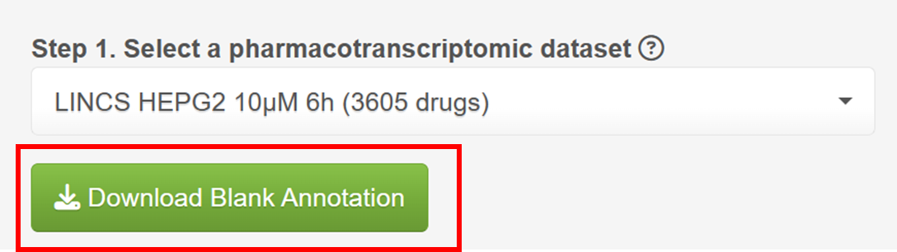

### Welcome to Benchmark module!  
In this module, you can evaluate Signature Search Methods (SSMs) based on signatures and well-annotated drugs in L1000.  
The Benchmark module requires the following settings:  

**1. Select a pharmacotranscriptomic dataset (L1000)**  
**2. Select SSMs to test (at least two)**  
**3. A oncogenic signature (header with gene and logFC) to perform test**  
**4. Drug annotations that users can download as a blank annotation table by clicking the download button**  
**Notably, SSP assumes that input oncogenic signatures are statistically significant (p < 0.05) by default, ensuring their relevance for further analysis.**  

**Notably, SSP use two types of drug annotation metrics (AUC and ES), and users need to select at least one metric to evaluate the performance of SSMs. It is impractical to annotate all drugs; however, the more annotations obtained, the more accurate the results will be.**  
Generally, **AUC** represents the drug efficacy form the experiments and **ES** represents the drug efficacy from the FDA-approved clinical indication. These two different metrics could comprehensively evaluate the SSMs both in experiment and clinic.    
**SSP also offers a primary annotated drug list in annotation module.**  

**1. AUC**  
If you have annotations for effective or ineffective L1000 drugs (generally based on whether the IC50 < 10μM), you can upload them in step 4a. The file should appear as follows (header with 'Compound.name' and 'Group'):  

We will then calculate the drug scores and rank them based on the confusion matrix using the Area Under the Curve **(AUC)**, where **a higher AUC indicates better performance**.  

**2. ES**
If you have annotations for effective L1000 drugs (generally based on clinical information, such as FDA-approved drugs), you can upload them in step 4b. The file should appear as follows:   

We will then calculate the drug scores and perform drug set enrichment score (**ES**), where **a lower ES indicates better performance**.  
Finally, click the 'Run' button, and you will obtain a job ID (**jobid**), starting with 'BEN'.  
It may take approximately 15 minutes to obtain the results, but you can close the page and enter the job ID in the **Job Center** for later result inquiry.  

For more information, please visit **Info-Help** page.
For users who want to obtain a primary annotation for quick test, please visit **Annotation** page.

