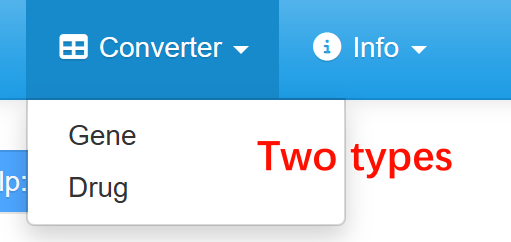

### Welcome to Converter Page (for Drug)  

SSP accepts annotation of **drug name**, and **the identifier of drug is drug name**. However, as there are other type of drug identifier (such as **PubChem Cid** and **InChIKeys**), The Converter page (for Drug) is introduced to provide an easy way to convert drugs to a compatible format.  
On this page, you can upload your drug list, and view the converted drug names immediately.  
**Please note that the Converter module only returns drugs that are within the PTDs.**  

Here are some tips:  
1. Converter accepts signature file with **no more than 1000 rows**.  
2. If you input a drug name list and select "Drug Name", SSP will attempt to correct drug names **(regarding capitalization and the presence of spaces)** to ensure consistency with the names in inner-built pharmacotranscriptomic dataset. This is very useful when you collect drug information on your own.  
3. **SSP accept the input in one-column tab-separated file (for ES) or two-column tab-separated file (for AUC).** SSP will keep the second column in output.   

In addition, we also provide a gene converter, you can access the sub-module by clicking on the different tabs.  

