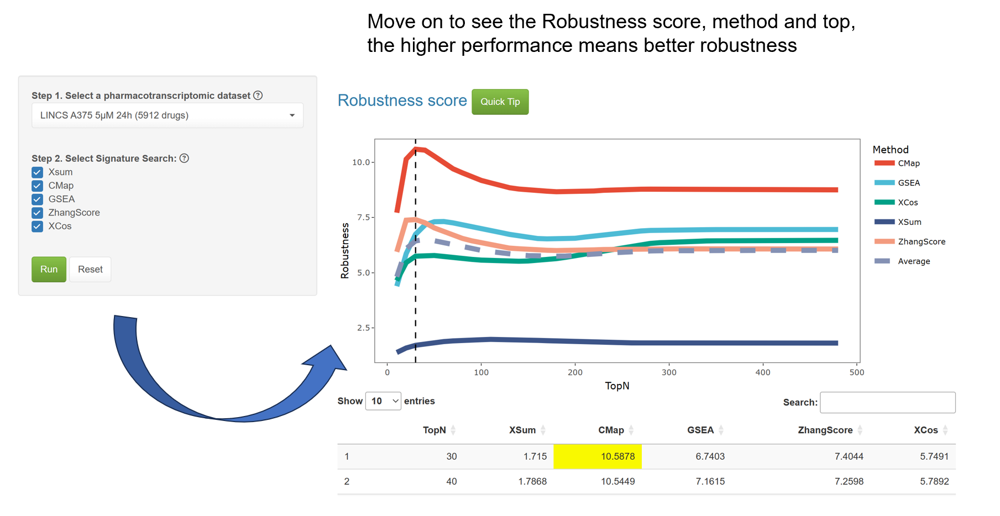

### Welcome to the Robustness Module!
The Robustness module enables the evaluation of signature search methods (SSMs) through the mechanism of drug self-retrieval.    
In the **Benchmark module**, we tested SSMs based on drug annotations.  
However, the drug repurposing of a rare cancer subtype can be challenging by insufficient drug annotations within pharmacotranscriptomic datasets (PTDs).   
Hence, we test the performance of SSMs based on **drug self-retrieval**.  
Briefly, we labeled these drugs from 1 to N (N being the order of drugs in one set).  
For each drug profile, we extracted the top x up-regulated and top x down-regulated DEGs and defined them as a signature. This signature was then queried into one of the SSMs to obtain the matching scores of these drugs.  
We then ranked the drugs based on their scores.  
To evaluate the robustness of these methods at different x values, three parameters were used:  
**1. Correlation (R) of the input and top1 output for all drugs.**  
**2. The mean of the difference scores between the top 1 and top 2 outputs.**  
**3. The standard deviation (SD) of the difference between the scores of the top 1 and top 2 outputs.**  
Finally, the drug retrieval performance score can be expressed by the following formula:

$$ 
performance \ score = \frac{Mean × R}{SD} 
$$

A satisfactory performance is achieved if the method **accurately returns the input drug (stronger correlation)** and **distinguishes well between drugs (more significant difference score) and maintains good stability (lower SD)**.  
In this study, we tested performance scores for the cases of x at 10, 20, 30 ... 480, respectively.   

Select a PTD to review the performance of SSMs, and a 'Quick Tip' will be available for result interpretation.  

As shown in the figure, a higher **performance score** indicates greater robustness, indicating that the method is more accurate.  
Robustness module may differ from that in the Benchmark module. Researchers are strongly encouraged to utilize the Benchmark module, in alignment with their specific fields of study. Should the number of topN genes from the Robustness module exceed the length of the OGS, it is recommended to assess whether the scores obtained from the Robustness module at the corresponding length are close to the optimal values. If not, consideration should be given to replacing the OGS.  
